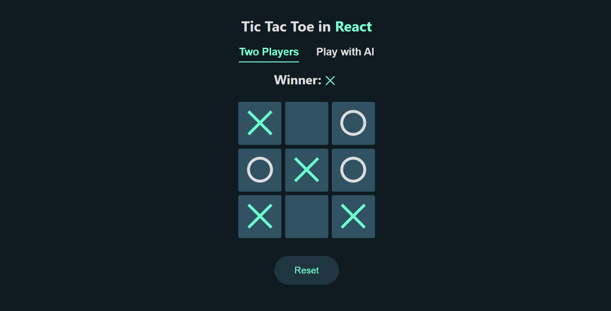

# Tic Tac Toe Game

This is a simple implementation of the Tic Tac Toe game using React. It features both a "Two Players" mode and a mode to play against AI (Artificial Intelligence) using the Minimax algorithm with alpha-beta pruning.

## Features

- Play against another player locally.
- Play against AI (AI uses the Minimax algorithm to find the best move).
- Reset the game at any point.
- Displays the current player and the winner.

## Setup and Installation

### Prerequisites

To run this project, you need to have the following installed:

- Node.js
- npm (Node package manager)

### Steps

1. **Clone the repository**:

   ```bash
   git clone https://github.com/your-username/tic-tac-toe-app.git
   cd tic-tac-toe-app
   ```

2. **Install dependencies**:

   ```bash
   npm install
   ```

3. **Run the development server**:

   ```bash
   npm start
   ```

4. Open the application in your browser by navigating to `http://localhost:3000`.

## Technologies Used

- React
- JavaScript
- CSS (for styling)
- Minimax algorithm with alpha-beta pruning for AI

## Screenshots



## License

This project is licensed under the MIT License.
Copyright (c) [2024] [Samvel Toroyan]

---

# Крестики-нолики

Это простая реализация игры "Крестики-нолики" с использованием React. Игра включает два режима: "Два игрока" и режим игры против ИИ (искусственного интеллекта) с использованием алгоритма Минмакс с альфа-бета отсечением.

## Особенности

- Игра против другого игрока локально.
- Игра против ИИ (ИИ использует алгоритм Минмакс для нахождения наилучшего хода).
- Сброс игры в любой момент.
- Отображение текущего игрока и победителя.

## Установка и настройка

### Требования

Для запуска этого проекта необходимо установить:

- Node.js
- npm (менеджер пакетов для Node.js)

### Шаги

1. **Клонировать репозиторий**:

   ```bash
   git clone https://github.com/your-username/tic-tac-toe-app.git
   cd tic-tac-toe-app
   ```

2. **Установить зависимости**:

   ```bash
   npm install
   ```

3. **Запустить сервер для разработки**:

   ```bash
   npm start
   ```

4. Откройте приложение в браузере, перейдя по адресу `http://localhost:3000`.

## Используемые технологии

- React
- JavaScript
- CSS (для стилей)
- Алгоритм Минмакс с альфа-бета отсечением для ИИ

## Лицензия

Этот проект лицензирован под лицензией MIT.
Copyright (c) [2024] [Samvel Toroyan]
